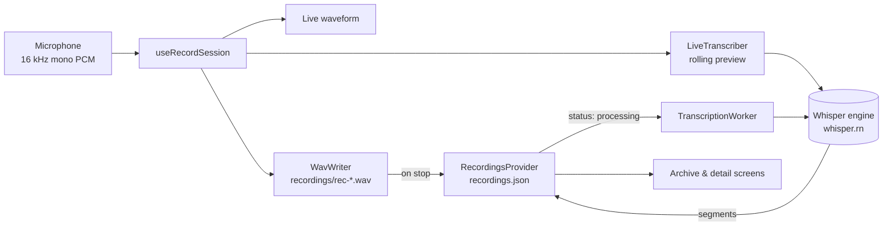

# Architecture

This document explains how the app is organized and how a recording moves from the microphone
to a searchable transcript. Read it before changing screens, state or storage.

## Overview



The app has three layers:

| Layer | Folder | Responsibility |
|---|---|---|
| Screens | `src/app/` | Layout and interaction. Each file is a route (Expo Router). |
| State | `src/store/` | Recordings and settings, shared through React context and saved to disk. |
| Services | `src/stt/`, `src/hooks/` | Microphone capture, WAV writing, Whisper transcription. |

UI components in `src/components/` are grouped by the screen that owns them (`record/`, `archive/`,
`profile/`). The shared ones are `glass.tsx`, `glass-tab-bar.tsx`, `ambient-background.tsx`, `bottom-sheet.tsx`
and `fade-swap.tsx`; shared motion tokens live in `src/constants/motion.ts` (see the design system).

## Navigation

```
src/app/
├── _layout.tsx            Root stack: providers, TranscriptionWorker, status bar
├── (tabs)/_layout.tsx     Tabs with the custom GlassTabBar
│   ├── index.tsx          Record
│   ├── archive.tsx        Archive
│   └── profile.tsx        Profile
└── recording/[id].tsx     Detail screen, pushed on top of the tabs
```

The root layout mounts the providers in this order:

```tsx
<SettingsProvider>          // settings are needed by the recordings store (auto-delete)
  <RecordingsProvider>
    <TranscriptionWorker /> // renders nothing; runs background transcription jobs
    <Stack>…</Stack>
  </RecordingsProvider>
</SettingsProvider>
```

`TranscriptionWorker` lives at the root on purpose: transcription keeps running when the user
switches tabs or opens a recording.

## State

### Recordings: `src/store/recordings.tsx`

```ts
type Recording = {
  id: string;                    // "rec-<timestamp>", also the WAV file name
  title: string;                 // "New Recording 3", editable on the detail screen
  createdAt: string;             // ISO timestamp
  duration: number;              // seconds
  uri: string | null;            // file:// URI of the WAV (null only for web sample data)
  waveform: number[];            // 0–1 amplitudes for drawing
  transcript: TranscriptSegment[]; // { start, end, text } in seconds
  transcriptStatus: 'none' | 'processing' | 'done' | 'failed';
  favorite: boolean;
  transcriptProgress?: number;   // 0–1 while transcribing
  transcriptError?: string;      // shown with the Retry button
  transcriptAttempts?: number;   // job starts that haven't finished (crash-loop guard)
  transcriptPartial?: {          // long recordings: chunks already transcribed
    segments: TranscriptSegment[];
    nextOffsetSec: number;       // where the next chunk starts
    model: string;               // a different model starts over
  };
};
```

The context exposes `recordings`, `getById`, `addRecording`, `updateRecording`, `deleteRecording`
and `toggleFavorite`. Every change is written back to disk right away.

**`transcriptStatus` drives the transcription.** Nothing calls the engine directly from a screen:

- The Record screen saves a new recording with `transcriptStatus: 'processing'`.
- `TranscriptionWorker` picks the oldest `'processing'` recording, transcribes it, and sets
  `'done'` (with segments) or `'failed'` (with a message).
- If the selected speech model isn't downloaded, the job waits (shown as *Waiting* in the Archive) and
  starts as soon as the model is installed.
- **Retry** sets the status back to `'processing'` and resets `transcriptAttempts` (`retryPatch` in
  `src/stt/job-recovery.ts`).
- **Cancel** (detail screen) sets `'none'` and clears the job fields (`cancelPatch`); the worker sees
  the running recording leave `'processing'` and stops the native job.
- Before each start the worker increments `transcriptAttempts` and makes sure it is on disk. A job
  interrupted because the app was closed is still `'processing'` on the next launch and starts again
  (long recordings resume after the last chunk saved in `transcriptPartial`). If it was already
  started twice without finishing (the app was killed, e.g. out of memory), it is set to `'failed'`
  instead, so it can't crash the app on every launch.

```
none ──Transcribe──► processing ──► done      (attempts / partial cleared)
                      │  ▲    └───► failed    (error, or killed twice: attempts ≥ 2)
                Cancel│  │Retry/Transcribe
                      ▼  │
                      none / failed
```

### Settings: `src/store/settings.tsx`

| Setting | Default | Used by |
|---|---|---|
| `displayName` | `''` | Profile header |
| `speechModel` | `small` | Live preview and the background worker |
| `liveTranscript` | `true` | Record screen (turns the rolling preview on or off) |
| `autoDelete` | `never` | Recordings store, applied once per app launch |
| `haptics` | `true` | Every haptic in the app, through `src/utils/haptics.ts` |

Saved settings are merged over the defaults key by key, so keys from older versions (or with a wrong
type) are dropped on load.

## Storage

Everything is stored in the app's private document directory. Nothing is synced or uploaded.

| Path | Contents |
|---|---|
| `recordings.json` | All recording metadata and transcripts |
| `settings.json` | User settings |
| `export.json` | Android only: the folder picked for exports (SAF URI) |
| `recordings/rec-<id>.wav` | Audio, 16 kHz mono 16-bit (about 1.9 MB per minute) |
| `models/ggml-*.bin` | Downloaded Whisper models |
| `models/ggml-*.bin.part` | A model download in progress (renamed only when complete) |

`src/utils/storage.ts` handles the JSON files. It uses `localStorage` on web (where `setItem` is
already atomic). On native, reads never throw and writes are crash-safe:

| File | Meaning |
|---|---|
| `<name>.json.tmp` | The new content, written first |
| `<name>.json.bak` | The previous good `<name>.json` |
| `<name>.corrupt-<timestamp>.json` | A file that could not be parsed, kept for manual recovery |

- **Write:** (1) write `.tmp`, (2) move `<name>.json` → `.bak`, (3) move `.tmp` → `<name>.json`.
  expo-file-system has no atomic replace (`moveSync({ overwrite: true })` deletes the destination
  first), so the rotation guarantees that a complete copy exists at every step.
- **Read:** `<name>.json` if it parses. If it is missing: `.tmp` (a complete write whose last rename
  did not happen), then `.bak`. If it is corrupt (unparseable, empty or the wrong shape): it is moved
  aside to `<name>.corrupt-<timestamp>.json` first, then `.bak`, then `.tmp` are tried. A corrupt file is
  never overwritten, and a write never runs before the file has been checked this session.
- `readJSONWithStatus()` reports the source (`main`, `temp`, `backup`, `none`) and whether anything was
  corrupt. The recordings store shows a one-time alert when it recovered data.
- Writes skip the disk's `fsync` (the API has none), so a power cut right after a write could still
  lose both copies on some file systems. A crashed or killed app is fully covered.

The recordings store writes `recordings.json` at most every 400 ms (trailing), skips writes when
nothing persistent changed, and flushes right away when the app goes to the background or the
provider unmounts. `flush()` on `useRecordings()` forces a write before heavy native work. Volatile
fields (`transcriptProgress`, or any other field ending in `Progress`) are never written. Settings are
written immediately through the same atomic path.

**Audio URIs are rebased on load.** `recordings.json` stores absolute `file://` URIs, but the iOS app
container path (`…/Application/<UUID>/Documents`) changes with every app update.
`resolveRecordingUri()` in `src/utils/recording-files.ts` keeps only the file name (`rec-<id>.wav`)
and points it at the current `documents/recordings/` folder. The store does this for every recording
on load and writes the fixed URIs back. Deleting audio uses it too. Web URIs are left unchanged.

Deleting a recording also deletes its WAV file. The auto-delete policy never removes favorites.

## Recording session

`src/hooks/record-session.native.ts` is the heart of the Record screen. It exposes a small state
machine:

```
idle → starting → recording ⇄ paused → saving → idle
```

While recording, each PCM chunk from the microphone (`@fugood/react-native-audio-pcm-stream`,
Android audio source `VOICE_RECOGNITION`) is used three times:

1. **Level meter:** RMS loudness → a smoothed bar every 60 ms for the waveform.
2. **`WavWriter`:** appended straight to the WAV file, so long recordings never stay in memory.
   The WAV header's length fields are patched every ~2 s of audio and exactly on stop, so the file is
   always playable.
3. **`LiveTranscriber`:** buffered for the live preview, if enabled (see speech-to-text.md).

**A take is never lost silently:**

- If the screen unmounts mid-take (Android recreates the Activity on font-size, density or locale
  changes), the hook finishes the WAV and hands the take to the screen's `onAutoStop`, which saves it
  like a normal stop. If the whole React tree is going away, the save may not reach disk; then the next
  bullet catches it.
- `<OrphanRecovery />` (`src/stt/orphan-recovery.tsx`, mounted in the root layout inside
  `RecordingsProvider`) scans `recordings/` ~1.5 s after mount. Any `rec-*.wav` not referenced by a
  recording (compared by file name, since URIs are rebased on load) gets its header repaired and is added
  as *Recovered Recording* with `transcriptStatus: 'processing'` (`createdAt` = file modification time,
  waveform from 90 small reads). A file a `WavWriter` is still writing is skipped.

**Screen off and background:**

- The screen is kept awake while a take is active (`expo-keep-awake`, tag `voice-recording`).
- **Android** silences the microphone of a background app unless it runs a *microphone* foreground
  service. The PCM stream has none, so `src/hooks/background-capture.android.ts` starts expo-audio's
  `AudioRecordingService` (enabled by `enableBackgroundRecording` in the expo-audio plugin config) by
  starting a tiny AMR `AudioRecorder` with `allowsBackgroundRecording: true` and pausing it immediately.
  It shows the "Recording audio" notification (Android 13+ asks for the notification permission first;
  expo-audio refuses to start the service without it). Tapping **Stop** there ends and saves the take.
  Without the service (permission denied, Android 9 and older) the status line says *Keep Voice open
  while recording*, and if the app was backgrounded anyway, *Audio may be missing while in background*.
- **iOS:** the plugin adds the `audio` background mode, and `background-capture.ts` sets an audio mode
  with `allowsRecording` and `allowsBackgroundRecording`, so the AudioQueue keeps recording.
- A watchdog reopens the microphone stream if no chunk arrived for 3 s while the app is in the
  foreground (e.g. after an iOS phone-call interruption). AppState transitions are logged.

### Platform variants

React Native picks `*.native.ts` on phones and the plain `.ts` file on web:

| Module | Phone | Web |
|---|---|---|
| `hooks/record-session` | Real microphone and WAV | `expo-audio` recorder or a simulated waveform |
| `stt/engine` | whisper.rn | Stub that reports transcription as unavailable |

The web build exists so the UI can be previewed in a browser. It starts with sample recordings
from `src/data/recordings.ts`; the phone app starts empty.

## Export

The download button on the detail screen opens `ExportSheet` (`src/components/archive/export-sheet.tsx`),
which hands the recording to `src/export/`:

| File | Role |
|---|---|
| `shared.ts` | Pure helpers: file names (`Product-team-meeting.pdf`), word count, dates, and the honest "transcript not available" reason |
| `markdown.ts` | `recordingToMarkdown(recording)`: title, metadata list, then `**[m:ss]** text` per segment (user text is escaped) |
| `pdf-template.ts` | `renderTranscriptHtml(recording)`: a self-contained A4 HTML page in the app's look (pastel blobs, chips, waveform SVG, timestamp pills, `@page` footer with page numbers). Pure, so it can be opened in a browser to preview |
| `pdf.ts` | Renders that HTML with `expo-print` and moves the result to `<cache>/exports/<Title>.pdf` |
| `deliver.native.ts` | Writes the file to `<cache>/exports/` and delivers it: Android saves into a folder picked with `Directory.pickDirectoryAsync()` (SAF; the URI is remembered in `export.json`), iOS and "Share file…" use `expo-sharing` |
| `deliver.ts` | Web: Markdown as a browser download, PDF through the browser print dialog (expo-print can't write files on web) |

If a recording isn't transcribed yet (or failed, or no speech was found), both formats still export, with a note saying
why there is no transcript instead of an empty page.

## Conventions

- Routes only in `src/app/`; everything else lives outside it.
- Path alias `@/` → `src/`.
- Colors, type, spacing and radii come from `src/constants/theme.ts`; see [design-system.md](design-system.md).
- Interactive elements carry a `testID` from `src/constants/test-ids.ts` for the Maestro E2E flows;
  see [testing.md](testing.md).
- Run `npx tsc --noEmit` and `npx expo lint` before committing.
