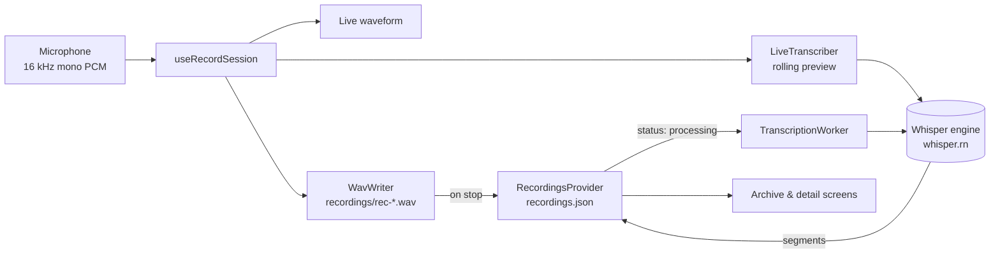

# Architecture

This document explains how the app is organized and how a recording moves from the microphone
to a searchable transcript. Read it before changing screens, state or storage.

## Overview



The app has three layers:

| Layer | Folder | Responsibility |
|---|---|---|
| Screens | `src/app/` | Layout and interaction. Each file is a route (Expo Router). |
| State | `src/store/` | Recordings and settings, shared through React context and saved to disk. |
| Services | `src/stt/`, `src/hooks/` | Microphone capture, WAV writing, Whisper transcription. |

UI components in `src/components/` are grouped by the screen that owns them (`record/`, `archive/`,
`profile/`). The only shared ones are `glass.tsx`, `glass-tab-bar.tsx` and `ambient-background.tsx`.

## Navigation

```
src/app/
├── _layout.tsx            Root stack: providers, TranscriptionWorker, status bar
├── (tabs)/_layout.tsx     Tabs with the custom GlassTabBar
│   ├── index.tsx          Record
│   ├── archive.tsx        Archive
│   └── profile.tsx        Profile
└── recording/[id].tsx     Detail screen, pushed on top of the tabs
```

The root layout mounts the providers in this order:

```tsx
<SettingsProvider>          // settings are needed by the recordings store (auto-delete)
  <RecordingsProvider>
    <TranscriptionWorker /> // renders nothing; runs background transcription jobs
    <Stack>…</Stack>
  </RecordingsProvider>
</SettingsProvider>
```

`TranscriptionWorker` lives at the root on purpose: transcription keeps running when the user
switches tabs or opens a recording.

## State

### Recordings: `src/store/recordings.tsx`

```ts
type Recording = {
  id: string;                    // "rec-<timestamp>", also the WAV file name
  title: string;                 // "New Recording 3", editable on the detail screen
  createdAt: string;             // ISO timestamp
  duration: number;              // seconds
  uri: string | null;            // file:// URI of the WAV (null only for web sample data)
  waveform: number[];            // 0–1 amplitudes for drawing
  transcript: TranscriptSegment[]; // { start, end, text } in seconds
  transcriptStatus: 'none' | 'processing' | 'done' | 'failed';
  language: 'fa' | 'en' | 'it';
  favorite: boolean;
  transcriptProgress?: number;   // 0–1 while transcribing
  transcriptError?: string;      // shown with the Retry button
};
```

The context exposes `recordings`, `getById`, `addRecording`, `updateRecording`, `deleteRecording`
and `toggleFavorite`. Every change is written back to disk right away.

**`transcriptStatus` drives the transcription.** Nothing calls the engine directly from a screen:

- The Record screen saves a new recording with `transcriptStatus: 'processing'`.
- `TranscriptionWorker` picks the oldest `'processing'` recording, transcribes it, and sets
  `'done'` (with segments) or `'failed'` (with a message).
- **Retry** only sets the status back to `'processing'`.
- A job interrupted because the app was closed is still `'processing'` on the next launch, so it
  starts again automatically.

### Settings: `src/store/settings.tsx`

| Setting | Default | Used by |
|---|---|---|
| `language` | `auto` | Initial language on the Record screen |
| `speechModel` | `small` | Live preview and the background worker |
| `liveTranscript` | `true` | Record screen (turns the rolling preview on or off) |
| `autoDelete` | `never` | Recordings store, applied once per app launch |
| `autoPunctuation`, `skipSilence`, `audioQuality`, `haptics` | — | Saved, **not applied yet** |

## Storage

Everything is stored in the app's private document directory. Nothing is synced or uploaded.

| Path | Contents |
|---|---|
| `recordings.json` | All recording metadata and transcripts |
| `settings.json` | User settings |
| `recordings/rec-<id>.wav` | Audio, 16 kHz mono 16-bit (about 1.9 MB per minute) |
| `models/ggml-*.bin` | Downloaded Whisper models |
| `models/ggml-*.bin.part` | A model download in progress (renamed only when complete) |

`src/utils/storage.ts` handles the JSON files. It uses `localStorage` on web, and a failed read
returns `null` instead of throwing, so a corrupt file can never crash the app.

Deleting a recording also deletes its WAV file. The auto-delete policy never removes favorites.

## Recording session

`src/hooks/record-session.native.ts` is the heart of the Record screen. It exposes a small state
machine:

```
idle → starting → recording ⇄ paused → saving → idle
```

While recording, each PCM chunk from the microphone (`@fugood/react-native-audio-pcm-stream`,
Android audio source `VOICE_RECOGNITION`) is used three times:

1. **Level meter:** RMS loudness → a smoothed bar every 60 ms for the waveform.
2. **`WavWriter`:** appended straight to the WAV file, so long recordings never stay in memory.
   The WAV header is patched with the real length when the session stops.
3. **`LiveTranscriber`:** buffered for the live preview, if enabled.

If the screen unmounts mid-recording, the hook stops the microphone and discards the partial file.

### Platform variants

React Native picks `*.native.ts` on phones and the plain `.ts` file on web:

| Module | Phone | Web |
|---|---|---|
| `hooks/record-session` | Real microphone and WAV | `expo-audio` recorder or a simulated waveform |
| `stt/engine` | whisper.rn | Stub that reports transcription as unavailable |

The web build exists so the UI can be previewed in a browser. It starts with sample recordings
from `src/data/recordings.ts`; the phone app starts empty.

## Conventions

- Routes only in `src/app/`; everything else lives outside it.
- Path alias `@/` → `src/`.
- Colors, type, spacing and radii come from `src/constants/theme.ts`; see [design-system.md](design-system.md).
- Run `npx tsc --noEmit` and `npx expo lint` before committing.
